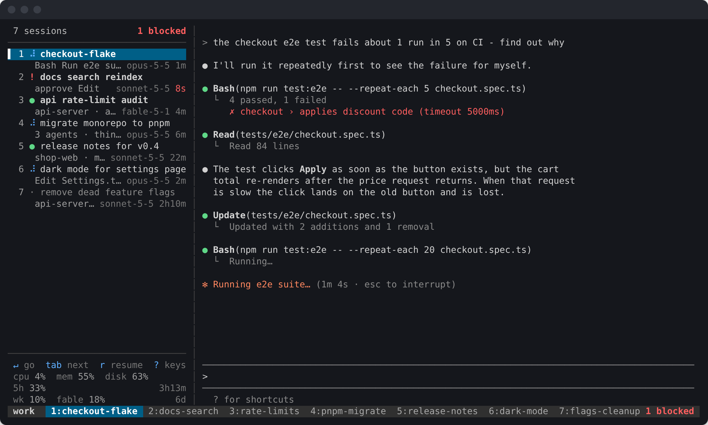
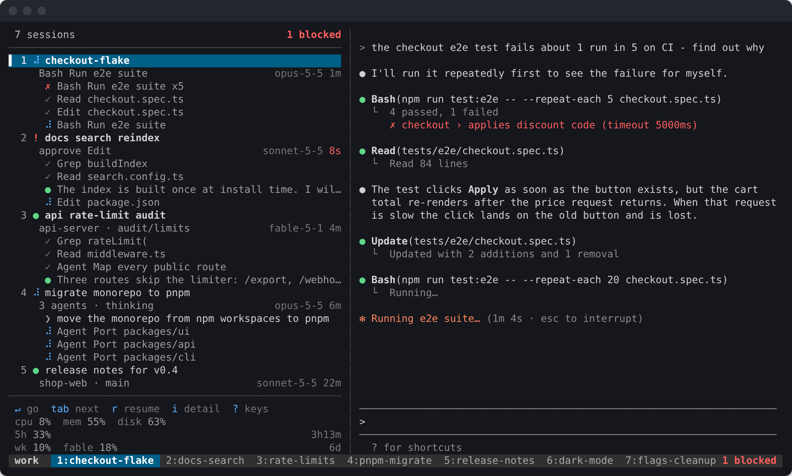
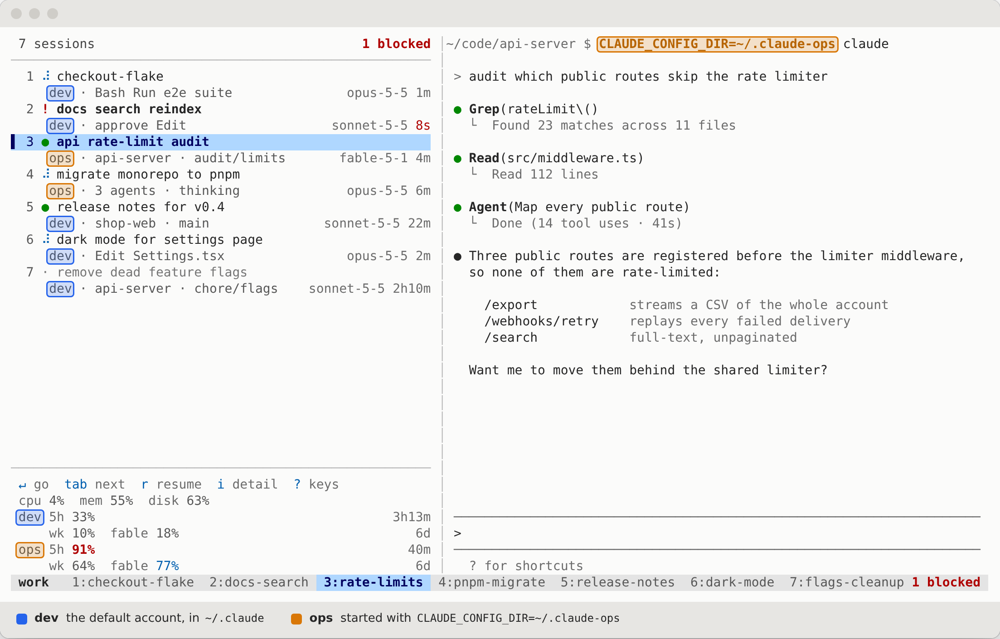

# cc-rail — a session rail for Claude Code

A left rail for tmux that shows every Claude Code session you have running, live:
what each one is doing right now, and which ones are waiting on you.

tmux keeps hosting the processes, so sessions still survive a dropped ssh
connection. `cc-rail` adds a narrow pane to each window plus a small collector.



Seven sessions in one tmux session: three working (the spinner, with the tool
each is running), one blocked on a permission prompt (`!`, and counted in the
tmux status line), two waiting on you (`●`, bold until you look) and one idle.
Window names come from the sessions themselves.

## Install

```sh
git clone https://github.com/Launchable-AI/claude-code-rail ~/cc-rail
~/cc-rail/bin/cc-rail install     # register the hooks in ~/.claude/settings.json
~/cc-rail/bin/cc-rail up          # add a rail to every claude window
```

`install` backs up your settings file first and leaves every other setting
alone. Sessions already running keep their old hooks until they restart.

`up` also binds **prefix + R** to `cc-rail adopt`, which brings back a rail you
hid with `q` without leaving the pane you are in. It never takes a key you have
already bound to something else; if `R` is taken, `cc-rail adopt` from a shell
is the way back and the rail says so when it hides.

It also binds **Alt-. / Alt-,** (no prefix) to step to the next / previous
session from any pane, the claude pane included, in the order the rail lists
them and wrapping at the ends. The same never-take-your-key rule applies. Move
them with `"navKeys": { "next": "M-l", "prev": "M-h" }` in
`~/.cc-rail/config.json`, or turn them off with `"navKeys": false`. (Ctrl-[ is
not possible: a terminal sends it as Escape. Ctrl-] is Claude Code's own key.
Alt-j/k are often taken by the host before they reach ssh.)

Optionally put it on your PATH: `ln -s ~/cc-rail/bin/cc-rail ~/.local/bin/cc-rail`.

## Running the collector as a service

`up` starts the collector in the background, which is fine until the machine
reboots. To have it always there:

```sh
cc-rail service install       # a systemd --user unit, enabled and started
sudo loginctl enable-linger $USER   # and at boot, not just at your first login
```

The unit records the node binary that installed it, so an nvm node is found
without a login shell; re-run `cc-rail service install` after a node upgrade.
`cc-rail service status` prints all three facts that matter — whether the unit
is enabled, whether it is running, and whether it starts before you log in —
and `cc-rail service uninstall` removes it.

A collector installed this way outlives tmux, so it does the tmux-side setup
itself: when a server appears it binds **prefix + R** and puts the summary in
the status line, then adopts each claude window as it opens. Nothing to run by
hand after a reboot — start tmux, start claude, the rail is there. While there
is no tmux server it polls slowly and does nothing else.

The status-line summary only ever says how many sessions are blocked on a
prompt. `cc-rail statusbar off` removes it for good (it is saved as
`"statusBar": false` in `~/.cc-rail/config.json`, so restarts and new tmux
servers leave it off); `cc-rail statusbar on` brings it back.

## Starting sessions yourself

Nothing to do. A session you start by hand — `claude` in a new tmux window,
however you like — is listed in the rail as soon as the collector sees it, and
the collector puts a rail in that window for you.

Pressing `q` closes the rail in a window and it stays closed; that is a
decision, not an accident. `cc-rail adopt` (or `a` in another rail) brings it
back. Set `"autoAdopt": false` in `~/.cc-rail/config.json` to only ever add
rails when you ask.

## Reading the rail

| glyph | meaning |
|---|---|
| `⠹` | working — the second line shows the tool it is running |
| `●` | your turn — it answered and is waiting for you |
| `!` | blocked — a permission prompt needs an answer |
| `·` | idle — nothing for 45 minutes |

Bold means you have not looked at it since it happened. Only "blocked" gets
loud colour; everything else stays quiet on purpose. `▌` marks the session in
the window you are currently in, which is a different question from where the
cursor is.

`i` cycles how much of each session's recent output the rail carries: off, the
selected session only, then every session at once — tool calls with their
outcome, what you asked, what Claude said, without switching to any of them.
`w` widens the rail when you want to actually read them:



The detail mode, the rail width and the palette are shared by every rail: they
are views of the same thing, in one terminal, so setting one in one window and
moving to another does not change it back. A rail added later comes up matching.
All three survive a restart.

Set `"detailLines"` in `~/.cc-rail/config.json` to change how many the
one-session view shows (3–12, default 8) and `"detailLinesAll"` for the
all-sessions view (default 4, deliberately shorter so a rail of sessions still
fits). `"detail": "one"` opens the rail already showing them.

## Model, account and plan usage

The right of each session's second line is the model it is on, so a session
left on the wrong one is visible without opening anything. If more than one
account is signed in across your sessions — a second `CLAUDE_CONFIG_DIR`, or a
session running on an API key — each row also names which one it is spending;
with a single account that column is not drawn.

Along the bottom sits your plan usage: the 5-hour window, the weekly window,
and any per-model weekly window such as Fable — the same bars `/usage` draws,
with the time until each one resets on the right. Windows that reset together
share a line, so the countdown they share is stated once. It goes quiet grey
below 75%, blue above it, red above 90%.

With two accounts signed in, each gets its own block, read from that account's
own config. Claude Code keeps the signed-in account in its config directory, so a
second account is a second directory: start a session with
`CLAUDE_CONFIG_DIR=~/.claude-ops claude`, log in there once, and every session
started that way spends that account while the rest stay on your default one.



Which account a session runs as is read from its environment in `/proc`, so
this part is Linux-only; elsewhere every session counts as the default account.

By default these come from Claude Code's own cache, and cc-rail only reads it.
Claude Code refills that cache when a session opens `/usage`, not as it works,
and treats its own copy as expired after an hour — so a rail is only as fresh
as the last `/usage` anyone opened. Past that hour the numbers are greyed, and
a window whose reset has already gone by is dated (`22h old`) rather than
counting down from zero, so a stuck block reads as stuck rather than as news.
Set `"showUsage": false` to hide the block.

`cc-rail usage on` makes the block live instead. The collector then asks the
same endpoint `/usage` asks, every five minutes while sessions are open, using
the OAuth token Claude Code has already stored — read-only: cc-rail never
refreshes, rewrites or sends that token anywhere but to Anthropic, and an
expired one is a poll it skips rather than one it tries to fix. Whichever
reading is newer, Claude Code's or ours, is the one drawn.

It is off by default for a reason worth knowing before you turn it on: the
endpoint is not part of Claude Code's documented surface, so a future version
may move it. Every failure is silent and falls back to the cache, keeping the
last good reading; `cc-rail usage` shows when it last succeeded and what went
wrong if it didn't, `cc-rail usage now` polls once in the foreground, and
`cc-rail doctor` carries the same line. `cc-rail usage off` returns to reading
Claude Code's cache and nothing else.

## Machine load

Above the plan usage sits one line for the machine the sessions run on:

```
 cpu 15%  mem 52%  disk 85%
```

CPU is measured over the last two seconds, memory counts page cache as free
(`MemAvailable`, what `free` calls available), and disk is the filesystem
holding `/` as `df` reports it. They share the plan windows' colours: grey,
blue past 75%, red past 90%. Point the disk figure somewhere else with
`"diskPath": "/data"`, or hide the line with `"showSystem": false`, in
`~/.cc-rail/config.json`.

## Keys

| key | action |
|---|---|
| `j` `k` / arrows | move |
| `↵` or `l` | go to that session |
| `1`–`9` | go by window number |
| `tab` | jump to the next session needing you |
| `Alt-.` / `Alt-,` | next / previous session — from any pane, not just the rail |
| `i` | recent-output detail: off → selected session → all sessions |
| `w` | widen every rail (34 → 56 → 80 → 34) so the feed is readable |
| `t` | palette for every rail: auto → light → dark |
| `d` | session facts: model, account, context size, last exchange |
| `n` / `N` | new session here / in a directory you type |
| `g` `G` | top / bottom (so `gg` works too) |
| `r` | resume a past session — every past session, not just this window's |
| `x` | close a session |
| click | go to that session (tmux mouse mode must be on) |
| wheel | browse the list without going anywhere |
| `q` | hide this rail (prefix + R, or `cc-rail adopt`, brings it back) |

`o` still cycles the detail modes, as it did when that was all it toggled.

`r` opens a picker of every Claude Code session you have run, newest first, and
`↵` resumes the one you pick into a new window. Each row shows where the session
was, relative to your home directory — `worktrees/app-webhook-override`, not a
bare `app-webhook-override` that reads like a project you have never heard of.

Every view other than the session list names itself in the header, and a picker
left open in a window is dropped when you come back to that window: arriving
somewhere should show you the sessions, not a menu you opened some time ago.

To reach the rail from a session pane use your existing `ctrl+alt+h`; `ctrl+alt+l`
goes back.

A rail redraws only the rows that changed, so anything else that writes to its
pane — `wall(1)` from a cron job is the usual culprit — would otherwise sit
there until those rows happened to change. Rails turn terminal messages off for
their own pane (`mesg n`, which is enough for a `wall` that is not run by root)
and repaint in full every few seconds regardless, so a rail that gets written
over cleans itself up.

## Window names

A window called `ubuntu` or `bash` tells you nothing. cc-rail renames those to the
session's own name — `cc-rail`, `e2e-gate-flake` — or a short kebab of its AI
title when it has no explicit name.

It only touches names that carry no information: tmux's own default, the
hostname, or the cwd's basename. A window you named yourself is never
overwritten. Two sessions sharing one window get one name between them --
whichever opened the window, plus a count of the others (`auth-refactor +1`) --
because a window has a single name and alternating between two titles is worse
than naming it after one. Once cc-rail has named a window it keeps it current as the title
settles, and stops managing it the moment you rename it by hand. The rail
itself always shows the full title, which is longer than any window name.

`cc-rail names restore` puts the originals back; `"renameWindows": "off"` (or
`"always"`) in `~/.cc-rail/config.json` changes the policy.

## Theme

`t` on the rail, or `cc-rail theme light|dark|auto`, sets the palette for every
rail at once. Rails repaint where they stand rather than restarting, so nothing
they were showing is lost. On `auto` each rail asks the terminal itself what
colour it is (OSC 11) before it draws anything, falls back to `COLORFGBG`, and
assumes dark if neither answers — wrong-but-dark is a readable mistake,
wrong-but-light is near-black on near-black.

A rail probes once, at startup, and keeps the answer: a probe from a running
rail would put an escape sequence into the middle of a live keyboard stream. So
when you change your terminal's theme under rails that are already up, `t` (or
`cc-rail theme`) is what tells them.

Every colour that carries text clears WCAG AA against its background in both
palettes, and the text hierarchy is carried by the greys themselves rather than
by the terminal's dim attribute. dim is not measurable: terminals disagree about
whether it applies to indexed colours at all, and where it does it halves the
contrast of text that was already recessive.

## Commands

| command | what it does |
|---|---|
| `cc-rail up` | attach rails to every claude window and start the collector |
| `cc-rail adopt` | add a rail to any claude window missing one |
| `cc-rail status [--json]` | print the overview to stdout |
| `cc-rail new [dir]` | open a new session in its own window |
| `cc-rail doctor` | check the installation |
| `cc-rail restart` | restart the collector — do this after changing cc-rail's code |
| `cc-rail down` | stop the collector |
| `cc-rail theme light\|dark\|auto` | set the palette for every rail, live |
| `cc-rail statusbar on\|off` | show the summary in the tmux status line |
| `cc-rail service install\|uninstall\|status` | run the collector as a systemd user service |
| `cc-rail usage on\|off\|now` | poll the plan limits rather than wait for `/usage` |

## How it knows

Three sources, fused, because no single one is sufficient:

1. **Hooks** (`SessionStart`, `PreToolUse`, `Stop`, …) — exact session identity
   and instant transitions. The hook is a 5-line shell script that spools the
   event and exits -- measured at ~11ms per event, so roughly 22ms added per
   tool call (PreToolUse + PostToolUse). Hooks are read at session startup, so
   a session that is already running keeps its old config until it restarts.
2. **Transcripts** (`~/.claude/projects/**/*.jsonl`) — tailed incrementally.
   A `tool_use` with no matching `tool_result` means a tool is in flight.
3. **The pane itself** (`capture-pane`) — the only place a permission prompt or
   a long silent think is visible. Consulted only when the other two are
   ambiguous, and capped per tick.

The plan-usage block and the per-session account come from Claude Code's own
config file (`cachedUsageUtilization`, `oauthAccount`) and from each session's
`/proc/<pid>/environ` — which is also how a second account is found, since
`CLAUDE_CONFIG_DIR` points at that account's own config and its own usage.
Read-only, and re-parsed only when a file changes. No credentials are read at
all unless you turn `cc-rail usage on`, which reads that account's stored OAuth
token to ask for the plan windows itself.

Without the hooks installed, cc-rail still works: it binds panes to transcripts by
matching the pane's terminal title against the session's name or AI title, and
keeps that binding sticky for the life of the pane. `cc-rail doctor` tells you when
a session was bound by guesswork.

## Scope: per tmux session, not global

The collector watches the whole tmux server, but **each rail shows only its own
tmux session's work by default**. A rail in `work` does not list sessions parked
in `scratch`.

To see everything from one rail, set `CC_RAIL_SCOPE=global` (or `"scope": "global"`
in `~/.cc-rail/config.json`). Rows from another tmux session are then prefixed
`@name`, and pressing enter on one uses `switch-client`, so your terminal
follows across tmux sessions rather than silently doing nothing.

## Layout

```
src/tmux.js        tmux introspection and control
src/transcript.js  incremental jsonl tailer
src/collect.js     fuses the three sources into one status per session
src/daemon.js      the collector loop; writes state/overview.json
src/hooks.js       folds spooled hook events
src/account.js     plan-limit windows and which account a session runs as
src/rail.js        the TUI
bin/cc-rail-hook      the shell shim Claude Code calls
```

State lives in `~/.cc-rail/state/`. Nothing is written to your repos.

`overview.json` is rewritten every collector tick; `ui.json` holds the view
settings the rails share; `focus.json` — which window each tmux session is
looking at — is separate and written only when it changes,
because a rail has to re-anchor its highlight within a frame rather than within
a tick. A rail publishes it itself the moment it sends you somewhere, so the
destination rail does not wait for the collector to notice.

## Uninstall

```sh
cc-rail service uninstall      # if you installed the systemd unit
cc-rail down
cc-rail uninstall              # removes the hooks and the prefix + R and Alt-./, bindings
tmux kill-pane -t <rail>    # or press q in each rail
```
